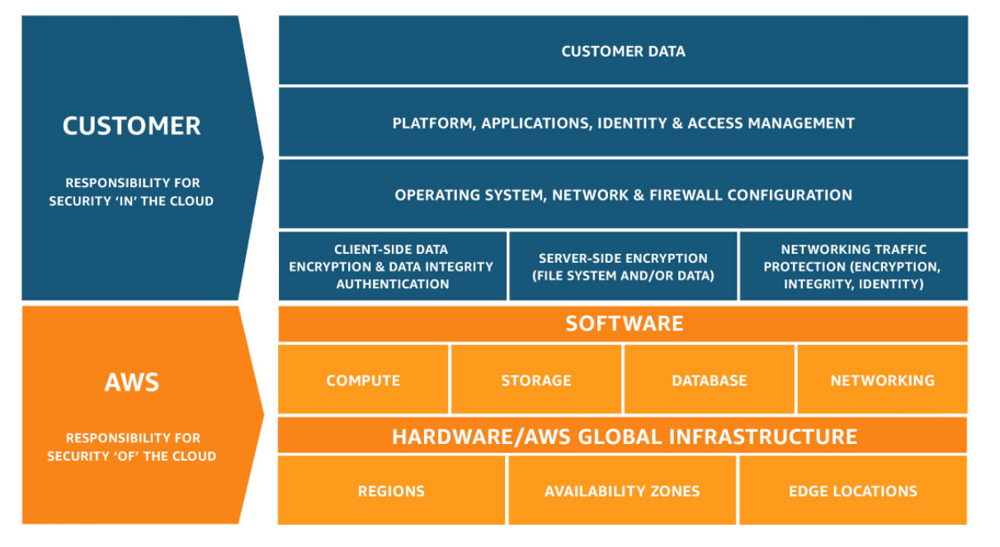

# AWS Cloud Security

## AWS Shared Responsbility Model



### AWS Responsibilities

AWS is responsible for protecting the infrastructure that runs all the services offered in the AWS Cloud. This includes:

- **Physical Security:** Ensuring the security of AWS data centers.
- **Infrastructure Security:** Protecting the hardware, software, networking, and facilities that support cloud services.
- **Network Security:** Safeguarding the infrastructure that supports network connectivity.
- **Virtualization Infrastructure:** Managing the virtualization layer on which AWS services run.

### Customer Responsibilities

- **Operating System:** Security of Amazon EC2 instance operating systems.
- **Applications:** Security measures for applications deployed in AWS.
- **Security Group Configuration:** Setting up and managing security groups.
- **Firewalls:** Configuration of OS or host-based firewalls.
- **Network Configurations:** Management of network access rules and configurations.
- **Account Management:** Ensuring secure account usage and management.

### Service Characteristics and Security Responsibility

#### Infrastructure as a Service (IaaS)

- **Customer:** Manage security, access controls, networking, and storage configurations.
- **Examples:** Amazon EC2, Amazon EBS, Amazon VPC.

#### Platform as a Service (PaaS)

- **AWS:** Managed by AWS, including database, firewall, OS.
- **Customer:** Management of code or data.
- **Examples:** AWS Lambda, Amazon RDS, AWS Elastic Beanstalk.

#### Software as a Service (SaaS)

- **AWS:** AWS centrally hosts and manages the infrastructure.
- **Customer:** Limited to using the software.
- **Examples:** AWS Trusted Advisor, AWS Shield, Amazon Chime.

## AWS Identity and Access Management (IAM)

> A resource is an entity in an AWS account that you can work with (e.g. Amazon EC2 instance or an Amazon S3 bucket)

- IAM provides fine-grained access control for AWS resources, applying settings across all regions.
- Determines **who** can access **which** resource and **how**.

### IAM Essential Components

- **IAM User:** Individual person or application.
- **IAM Group:** Collection of IAM users.
- **IAM Policy:** Document defining access levels.
- **IAM Role:** Set of permissions not attached to a single user.

### IAM Access Types

#### Programmatic Access

- **Authentication:** Using access key ID and secret access key.
- **Usage:** AWS CLI and SDKs.

#### AWS Management Console Access

- **Authentication:** Account ID or alias, IAM username, and password.
- **MFA:** Multi-factor authentication for additional security.

#### Authorization and IAM Policies

- **Permission Assignment:** Via IAM policies.
- **Default:** All permissions are implicitly denied.
- **Best Practice:** Adhere to the principle of least privilege.

#### IAM Policies Types

- **Identity-Based Policies:** Aached to IAM entities.
- **Resource-Based Policies:** Attached to a specific AWS resource.

#### IAM Policy Precedence

1. **Explicit Deny:** Overrides other permissions.
1. **Explicit Allow:** Permits actions not explicitly denied.
1. **Implicit Deny:** Default state in the absence of explicit permissions.

```json
{
    "Version": "2012-10-17",
    "Statement": [
        {
            "Effect": "Allow",
            "Action": [
                "DynamoDB:*",
                "s3:*"
            ],
            "Resource": [
                "arn:aws:dynamodb:region:account-number-without-hyphens:table/table-name",
                "arn:aws:s3:::bucket-name",
                "arn:aws:s3:::bucket-name/*"
            ]
        },
        {
            "Effect": "Deny",
            "Action": [
                "dynamodb:*",
                "s3:*"
            ],
            "NotResource": ["arn:aws:dynamodb:region:account-number-without-hyphens:table/table-name”,"arn:aws:s3:::bucket-name",
                "arn:aws:s3:::bucket-name/*"
            ]
        }
    ]
}
```

#### IAM Groups

- Group multiple users under the same permission set.
- A user can belong to multiple groups.

#### IAM Roles

- Assign specific permissions not tied to a single user.
- Can be assumed by people, applications, or services.

## Securing a new AWS Account

Key steps:

1. **Initial Setup:** Use the root user to create an IAM user and group with administrative permissions.
1. **Root User Security:** Disable root user access keys and enable strong password policies.
1. **Sign-in:** Use new IAM user credentials for account access.
1. **MFA Setup:** Enable MFA for enhanced security.

### MFA Options

1. Virtual
1. U2F Security Key
1. Hardware MFA

### AWS CloudTrial

- **Monitoring:** Tracks user activity and API usage.
- **Event History:** Basic 90-day history by default.
- **Extended Logging:** Enable for comprehensive auditing and longer-term logging.

### Billing Reports

- **Enablement:** Activate billing reports like the AWS Cost and Usage Report.
- **Utility:** Provides detailed usage and cost information.

## Securing Accounts

### AWS Organizations

- **Centralized Management:** Manages multiple AWS accounts from a single location.
- **Organizational Units (OUs):** Groups AWS accounts into OUs with distinct access policies.
- **IAM Integration:** Combines AWS Organizations' control with IAM permissions.
- **Service Control Policies (SCPs):** Establishes rules for service and API actions accessible in each AWS account.

### Service Control Policies (SCPs)

- **Control Mechanism:** Provides centralized control over permissions in AWS accounts within an organization.
- **Limits Permissions:** Ensures compliance with access control guidelines by specifying the maximum permissions.
- **Policy Nature:** SCPs are akin to IAM policies but only restrict; they never grant additional permissions.

### AWS Key Management Service (AWS KMS)

- **Key Management:** Creates and manages cryptographic keys.
- **Encryption Control:** Facilitates encryption across AWS services and user applications.
- **Audit Integration:** Works in conjunction with AWS CloudTrail for key usage logging.
- **Security Modules:** Utilizes hardware security modules (HSMs) for key protection.

### Amazon Cognito

- **User Identity Management:** Provides user sign-up, sign-in, and access control functionalities for web and mobile applications.
- **Directory Services:** Functions similarly to an active directory.

### AWS Shield

- **DDoS Protection:** A managed service for mitigating distributed denial of service attacks.
- **Standard vs. Advanced:** AWS Shield Standard is automatically enabled, while AWS Shield Advanced offers additional protections for a fee.
**Uptime Assurance:** Aims to minimize application downtime and latency during attacks.

## Securing Data on AWS

### Encryption of Data At Rest

- Encryption encodes data with secret key
- AWS supports encryption of data at rest which means data stored physically is encrypted
- You can encrypt data stored in any service that is supported by AWS KMS

- **Encryption Mechanism:** Data is encrypted using a secret key.
- **Support:** AWS supports encryption for data at rest, applicable to services integrated with AWS KMS.

### Encryption of Data in Transit

- **TLS/SSL Utilization:** Encrypts data during transmission using Transport Layer Security (TLS) or Secure Sockets Layer (SSL).
- **Certificate Management:** AWS Certificate Manager aids in managing and deploying TLS/SSL certificates.

### Securing Amazon S3 Buckets and Objects

**Default Privacy:** S3 buckets and objects are private by default.
**Access Control Tools:** Include S3 Block Public Access, IAM policies, bucket policies, ACLs, and AWS Trusted Advisor checks.

## Ensuring Compliance

### AWS Compliance Programs

- **Engagement with Auditors:** AWS collaborates with third-party auditors to provide detailed compliance information.
- **Trustworthy Information:** Offers insight into AWS policies, processes, and controls.

### AWS Config

- **Configuration Management:** Assesses, audits, and evaluates configurations of AWS resources.
- **Monitoring:** Enables continuous monitoring and automatic evaluation of configurations.
- **Change Review:** Allows examination of configuration changes and historical data.
- **Compliance Auditing:** Simplifies the process of compliance auditing and security analysis.

### AWS Artifact

- **Compliance Resource:** A gateway to compliance-related documents.
- **Accessibility:** Available directly from the AWS Management Console under Security, Identity, & Compliance.
- **Documentation Access:** Provides security and compliance reports and agreement management.
